# Class Diagram — Hotel Booking System

> **Архітектура**: Clean Architecture з 4 шарами + два варіанти presentation: Web (основний) і Console (legacy/Lab 34 demo).

## UML (Mermaid)

```mermaid
classDiagram
    %% ── Abstract base classes (поліморфізм) ──────────────────────────────
    class EntityBase {
        <<abstract>>
        +int Id
        +Display() string*
        +ToString() string
        +Equals(object) bool
        +GetHashCode() int
    }

    class PersonBase {
        <<abstract>>
        +string FirstName
        +string LastName
        +string Email
        +string FullName
        #PersonBase(firstName, lastName, email)
    }

    %% ── Domain entities ──────────────────────────────────────────────────
    class Room {
        +int Number
        +int Floor
        +RoomType Type
        +decimal PricePerNight
        +RoomStatus Status
        +int Capacity
        +bool IsAvailable()
        +void SetStatus(RoomStatus)
        +Display() string
    }

    class Guest {
        +string Phone
        +string PassportNumber
        +DateTime DateOfBirth
        +int Age
        +Display() string
    }

    class Booking {
        +int RoomId
        +int GuestId
        +DateTime CheckInDate
        +DateTime CheckOutDate
        +BookingStatus Status
        +PaymentStatus PaymentStatus
        +decimal TotalPrice
        +int Nights
        +void Confirm()
        +void CheckIn()
        +void CheckOut()
        +void Cancel(string)
        +bool OverlapsWith(DateTime, DateTime)
        +Display() string
    }

    class Hotel {
        +string Name
        +int StarRating
        +Display() string
    }

    %% ── Domain services ──────────────────────────────────────────────────
    class PricingEngine {
        <<static>>
        +Calculate(Room, DateTime, DateTime) decimal
        -GetSeasonMultiplier(DateTime) decimal
    }

    %% ── Domain interfaces ────────────────────────────────────────────────
    class IUnitOfWork {
        <<interface>>
        +IBookingRepository Bookings
        +IRoomRepository Rooms
        +IGuestRepository Guests
        +SaveAsync() Task
    }

    class IRepository~T,TId~ {
        <<interface>>
        +GetByIdAsync(TId) Task~T~
        +GetAllAsync() Task
        +AddAsync(T) Task~T~
        +UpdateAsync(T) Task
        +NextIdAsync() Task~TId~
    }

    class IBookingRepository {
        <<interface>>
        +GetByGuestIdAsync(int) Task
        +GetByRoomIdAsync(int) Task
    }
    class IRoomRepository { <<interface>> }
    class IGuestRepository {
        <<interface>>
        +GetByEmailAsync(string) Task~Guest~
    }

    %% ── Infrastructure ───────────────────────────────────────────────────
    class JsonRepositoryBase~T~ {
        <<abstract>>
        #_filePath string
        #_items List~T~
        +PersistAsync() Task
        #EnsureLoadedAsync() Task
        #GetId(T) int*
    }

    class JsonUnitOfWork { +SaveAsync() Task }
    class InMemoryUnitOfWork {
        +SaveAsync() Task
        +SeedDemoDataAsync() Task
    }

    %% ── Application services ─────────────────────────────────────────────
    class BookingService {
        +CreateBookingAsync(...) Task~Booking~
        +ConfirmBookingAsync(int) Task~Booking~
        +CheckInAsync(int) Task~Booking~
        +CheckOutAsync(int) Task~Booking~
        +CancelBookingAsync(int, string) Task~Booking~
    }

    class RoomSearchService {
        +SearchAvailableAsync(...) Task
        +GetAllRoomsAsync() Task
    }

    class GuestService {
        +RegisterGuestAsync(...) Task~Guest~
    }

    class ReportService {
        +GetOccupancyReportAsync(...) Task
        +GetRoomTypeReportAsync() Task
        +GetTopGuestsAsync(int) Task
    }

    class BookingExtensions {
        <<static>>
        +Active() IEnumerable
        +TotalRevenue() decimal
        +HasConflict(...) bool
    }

    %% ── Presentation: Web (ASP.NET Core) ─────────────────────────────────
    class WebProgram {
        <<entry-point>>
        +Configure DI
        +Map endpoints
        +UseStaticFiles()
    }

    class BookingEndpoints {
        <<minimal API>>
        +GET /api/bookings
        +POST /api/bookings
        +PUT /api/bookings/id/confirm
        +PUT /api/bookings/id/checkin
        +PUT /api/bookings/id/checkout
        +DELETE /api/bookings/id
    }

    class RoomEndpoints {
        <<minimal API>>
        +GET /api/rooms
        +GET /api/rooms/available
    }

    class GuestEndpoints {
        <<minimal API>>
        +GET /api/guests
        +POST /api/guests
    }

    class ReportEndpoints {
        <<minimal API>>
        +GET /api/reports/occupancy
        +GET /api/reports/room-types
        +GET /api/reports/top-guests
    }

    class WebGUI {
        <<wwwroot/index.html>>
        +Dashboard
        +Bookings table
        +Rooms grid
        +Guests list
        +Reports
        +Modal forms
    }

    %% ── Presentation: Console (Lab 34 baseline) ──────────────────────────
    class MainMenu {
        <<console>>
        +RunAsync() Task
    }

    %% ── Inheritance ──────────────────────────────────────────────────────
    EntityBase <|-- PersonBase : extends
    EntityBase <|-- Room       : extends
    EntityBase <|-- Booking    : extends
    EntityBase <|-- Hotel      : extends
    PersonBase <|-- Guest      : extends

    IRepository <|-- IBookingRepository
    IRepository <|-- IRoomRepository
    IRepository <|-- IGuestRepository

    %% ── Associations ─────────────────────────────────────────────────────
    Booking --> Room  : roomId ref
    Booking --> Guest : guestId ref
    Hotel   *-- Room  : contains

    %% ── Implementations ──────────────────────────────────────────────────
    InMemoryUnitOfWork ..|> IUnitOfWork
    JsonUnitOfWork     ..|> IUnitOfWork

    %% ── Application → Domain (DIP) ───────────────────────────────────────
    BookingService    --> IUnitOfWork : DI ctor
    RoomSearchService --> IUnitOfWork : DI ctor
    GuestService      --> IUnitOfWork : DI ctor
    ReportService     --> IUnitOfWork : DI ctor
    BookingService    --> PricingEngine : uses
    ReportService     ..> BookingExtensions

    %% ── Web Presentation → Application ──────────────────────────────────
    WebProgram        ..> BookingService : composition root
    WebProgram        ..> RoomSearchService
    WebProgram        ..> GuestService
    WebProgram        ..> ReportService
    BookingEndpoints  ..> BookingService
    RoomEndpoints     ..> RoomSearchService
    GuestEndpoints    ..> GuestService
    ReportEndpoints   ..> ReportService
    WebGUI            ..> BookingEndpoints : HTTP fetch
    WebGUI            ..> RoomEndpoints
    WebGUI            ..> GuestEndpoints
    WebGUI            ..> ReportEndpoints

    %% ── Console Presentation → Application ──────────────────────────────
    MainMenu          ..> BookingService : direct call
```



## Шари та правило залежностей

```
Web GUI (HTML/JS, wwwroot/)
         ↓  fetch('/api/...')
Web API (ASP.NET Core Minimal API)
         ↓
Application Services (BookingService, ReportService, …)
         ↓
Domain (Entities, Interfaces, PricingEngine)  ←  Infrastructure (Json* repos)
```

Залежності спрямовані всередину (Clean Architecture). Infrastructure реалізує інтерфейси Domain, але Domain не знає про Infrastructure. **Web і Console — два варіанти presentation, обидва покладаються на ті ж Application-сервіси**.

## Ключові архітектурні рішення

| Рішення | Обґрунтування |
|---------|--------------|
| `EntityBase` (abstract) | Спільний Id, поліморфний `Display()`, Equals/GetHashCode |
| `PersonBase` (abstract) | Спільна валідація імені/email; готовність до Staff, Manager |
| `IUnitOfWork` | Атомарне збереження; легка заміна InMemory ↔ JSON |
| `PricingEngine` (static) | Domain service без стану — чиста функція |
| `JsonRepositoryBase<T>` (Template Method) | Спільний CRUD + I/O, конкретні репо лише `GetId()` |
| **ASP.NET Core Minimal API** | Тонкий шар — endpoints викликають Application services без бізнес-логіки в контролерах |
| **Static GUI у wwwroot** | Frontend без фреймворків (HTML/CSS/JS), отримує дані через REST API |
| **Console + Web одночасно** | Application/Domain/Infrastructure 100% переважно — підтверджує DIP, обидва presentation плагіняться |
