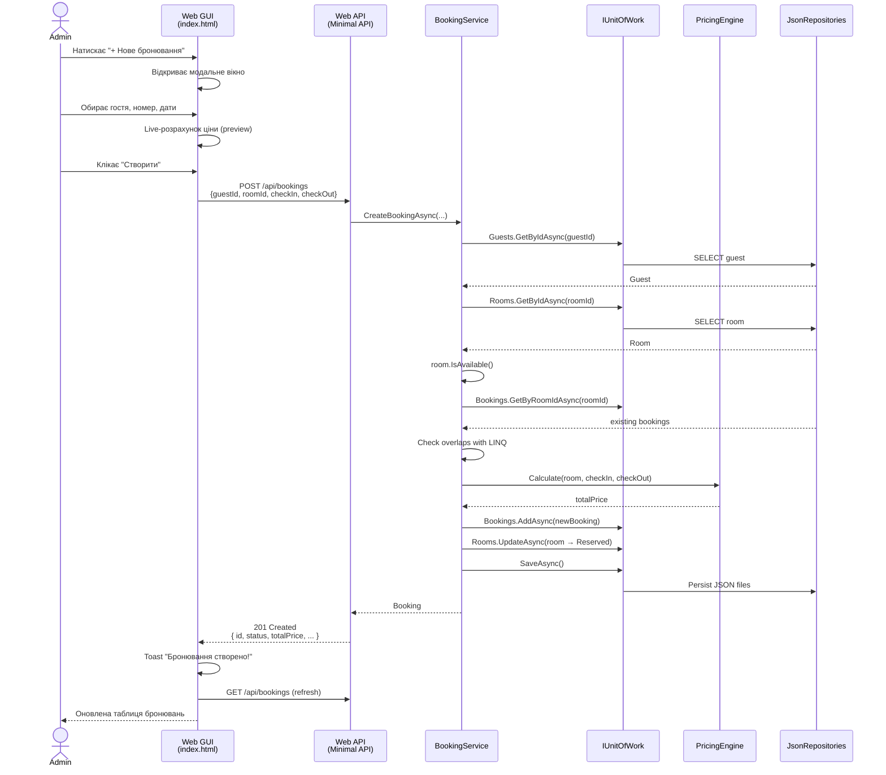
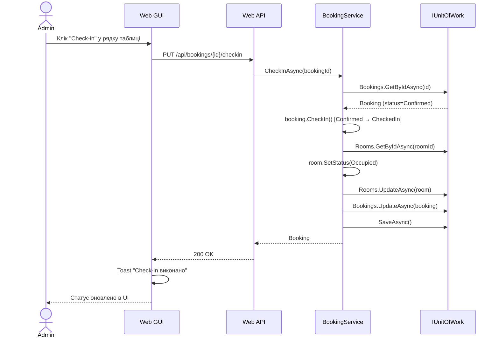
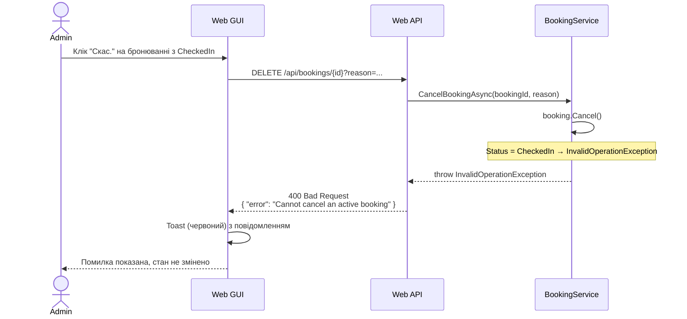
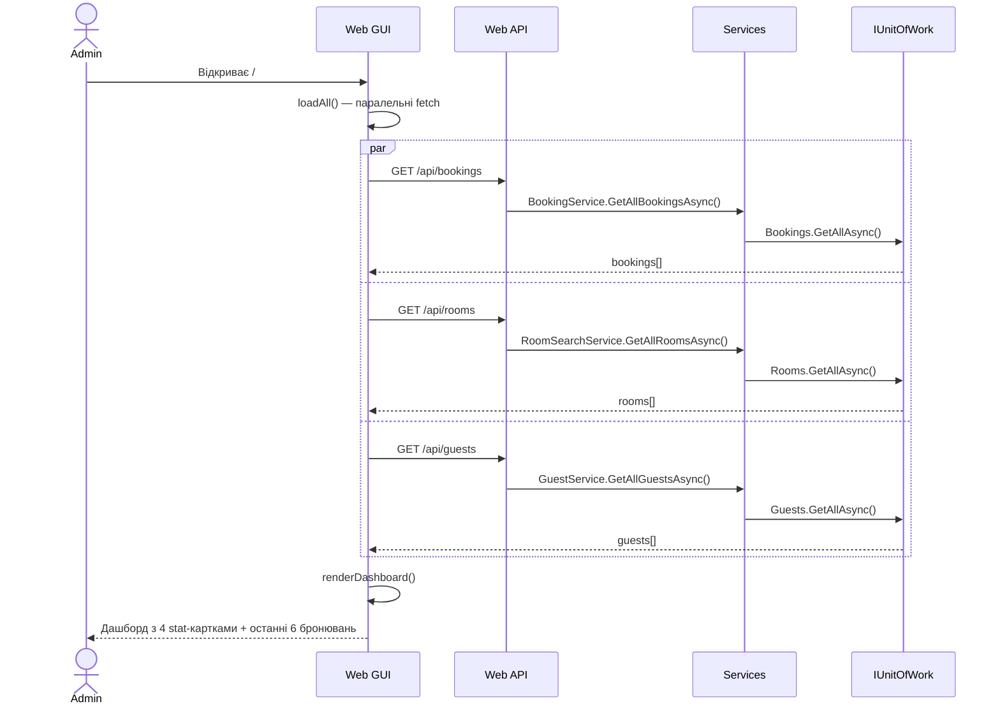
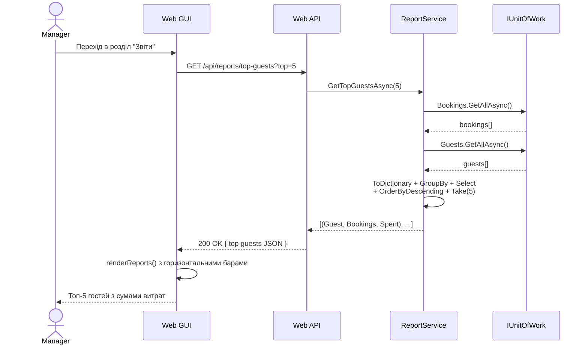

# Sequence Diagrams — Hotel Booking System

> **Архітектура**: Web GUI → REST API → Application Service → Domain → Infrastructure

---

## UC-1: Створення бронювання (через Web GUI)



---

## UC-2: Check-in (через Web GUI)



---

## UC-3: Скасування з помилковим станом (негативний сценарій)



---

## UC-4: Завантаження дашборду (READ-only сценарій)



---

## UC-5: Звіт ТОП гостей (LINQ-аналітика)



---

## Архітектурний потік (загальний)

```
Admin/Manager (browser)
        ↓ HTML form
   Web GUI (vanilla JS)
        ↓ fetch('/api/...', {method, body})
   ASP.NET Core Minimal API endpoint
        ↓ DI inject
   Application Service (e.g. BookingService)
        ↓ uses interface
   IUnitOfWork (Domain contract)
        ↓ implementation
   JsonUnitOfWork → JsonRepository → File I/O
        ↑ result
        ↑ JSON serialized
        ↑ Results.Ok(domainObject)
   GUI: state.bookings = json; render*()
```
